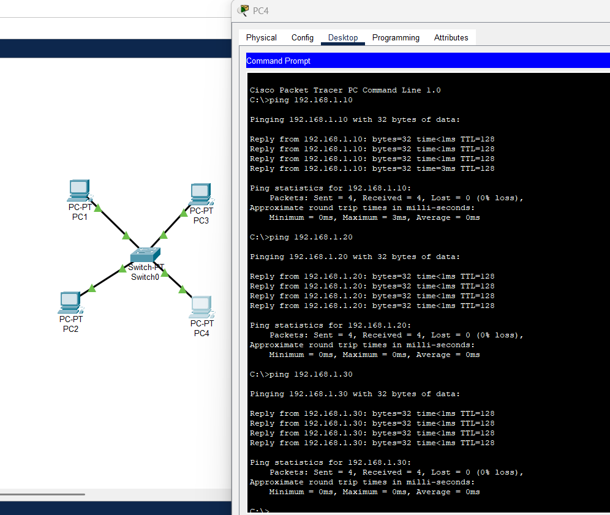

# Configuração de Rede Estrela

Este projeto configura uma topologia de rede estrela no **Cisco Packet Tracer** para atender às necessidades de comunicação da equipe de produção de um show. A topologia conecta quatro PCs a um switch central, permitindo que todos os membros da equipe troquem informações de forma eficiente.

---

## 🎯 **Objetivo**
Configurar e testar uma rede em topologia estrela para garantir que todos os dispositivos consigam se comunicar corretamente. O objetivo é facilitar a comunicação entre os membros da produção durante o evento.

---

## 🛠️ **Ferramentas Utilizadas**
- **Cisco Packet Tracer**: ferramenta de simulação de redes.
- **GitHub**: para versionamento e compartilhamento do projeto.

---

## ⚙️ **Configurações Realizadas**

### **Topologia**
- Um switch central conecta 4 PCs representando os membros da equipe.
- Os PCs estão conectados ao switch por cabos Ethernet.

### **Endereços IP**
Os dispositivos foram configurados com os seguintes endereços IP, todos pertencentes à mesma sub-rede:

| Dispositivo | Endereço IP     | Máscara de Sub-rede |
|-------------|-----------------|---------------------|
| **PC1**     | 192.168.1.10   | 255.255.255.0      |
| **PC2**     | 192.168.1.20   | 255.255.255.0      |
| **PC3**     | 192.168.1.30   | 255.255.255.0      |
| **PC4**     | 192.168.1.40   | 255.255.255.0      |

---

## 📂 **Arquivos do Projeto**
- **rede_estrela_show.pkt**: arquivo do projeto criado no Cisco Packet Tracer.
- **topologia.png**: imagem da topologia configurada e resultado dos testes de conectividade.

---

## 🚀 **Como Testar o Projeto**
1. Baixe o arquivo `rede_estrela_show.pkt`.
2. Abra-o no **Cisco Packet Tracer**.
3. Execute os testes de conectividade:
   - Acesse o **Prompt de Comando** em qualquer PC.
   - Use o comando `ping` para verificar a comunicação com os outros PCs.

---

## 📸 **Imagens**
- **Topologia Configurada**:
  

